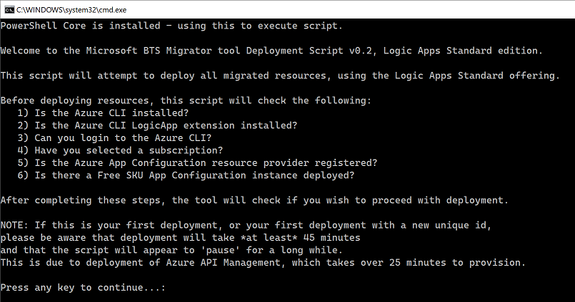
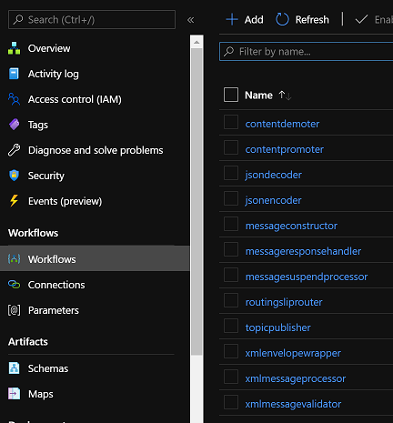
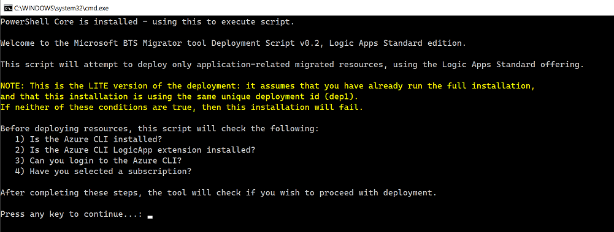

# Change Log

# v1.0.0 - August 17, 2021
This is a major release, adding support for Logic Apps Standard, new deployment scripts, a new adapter, and the ability to deploy only application resources.

## 1) New Deployment Scripts
Previously, deployment was handled by the *Deploy-All.ps1* and *TearDown-All.ps1* PowerShell scripts.
These scripts ran unattended, using Azure CLI commands, and assumed the user had already selected the correct subscription for deployment.

Those scripts are still there, but the default is to now run in an Interactive mode, which check that certain conditions are met, 
prompt the user for the subscription to deploy to, and ask the user for confirmation before starting the deployment.

There is a new **Deploy-All.bat** file, which will start the deployment in interactive mode - this file can either be double-clicked, or started from a command prompt.

There is also a **Deploy-All-Unattended.bat** file, which starts the deployment in unattended mode (which was the previous default).

The deployment steps differ depending on the Target selected:

### Consumption or ConsumptionLite Targets
The **Deploy-All.bat** file will perform the following steps:
- Check that the Azure CLI is installed.
- Check that you can login to the Azure CLI.
- Prompt you to select a subscription (if you have access to more than one).
- Check that the *Azure App Configuration* Resource Provider is registered in the selected subscription (and will register it if not).
- Check if there is an *Azure App Configuration* instance deployed to this subscription using the Free SKU.
- Check if there is an *Integration Account* instance deployed to this subscription using the Free SKU.
- Check that you wish to continue deployment to the selected subscription.

### Standard or StandardLite Targets
The **Deploy-All.bat** file will perform the following steps:
- Check that either PowerShell Core (pwsh) or PowerShell v5.2+ is installed (required for JSON merging functionality).
- Check that the Azure CLI is installed.
- Check if the *logicapp* CLI extension is installed (and install it if not - note that this extension is currently in preview).
- Check that you can login to the Azure CLI.
- Prompt you to select a subscription (if you have access to more than one).
- Check that the *Azure App Configuration* Resource Provider is registered in the selected subscription (and will register it if not).
- Check if there is an *Azure App Configuration* instance deployed to this subscription using the Free SKU.
- Check that you wish to continue deployment to the selected subscription.

### Unattended Deployment
If you wish to perform an unattended deployment for any Target, you can execute the **Deploy-All-Unattended.bat** file.
This script will deploy to whatever subscription you last set as active in the Azure CLI (which may not be your default subscription).

You can also execute **Deploy-All.ps1** with a parameter of "runUnattended 1" to execute in unattended mode.

### TearDown Scripts
The **TearDown-All.bat** file runs in unattended mode only, and uses whatever subscription was last set as active.

## 2) Logic Apps Standard (single-tenant) Support
This is the headline change for this release.
If you select a target of "Standard" (or "StandardLite" - see the next section below), the tool will output all Logic App resources as Standard Logic Apps (aka "Single-Tenant"). [See here for more info on Logic Apps Standard](https://docs.microsoft.com/en-us/azure/logic-apps/single-tenant-overview-compare).

Example command for performing a migration:

`aim migrate -a "microsoft.biztalk.msidiscoverer.msifiles=C:\Temp\SampleMSIs\Aim.HttpJsonOrch.msi" --primary-region "West US" --target Standard --unique-deployment-id dep1`

The new Logic Apps Standard resources are:

- *MessageBus Logic App*, containing a new workflow that refreshes the API Management cache when Azure App Config changes.
- *SystemApplication Logic App*, containing workflows for all intermediaries e.g. JsonEncoder, JsonDecoder, XmlMessageTranslator etc.
- *Application Logic App(s)*, containing workflows for Receive Adapters, Send Adapters, Process Managers (Orchestrations) and Topic Subscribers.

### Limitations to Logic Apps Standard Support
There are a number of limitations to Logic Apps Standard support:
- FlatFile actions are not supported, these are Consumption only for now as there is no FlatFile action in the Logic Apps Standard runtime (support is on the way though).
- BizTalk Maps require a Consumption Logic App and Integration Account (this is due to a lack of support for C# code in the XSLT engine used by the built-in XSLT action in Logic Apps Standard).
- An Integration Account is still needed (to execute BizTalk Maps, and provide a metadata store to lookup a schema name by BizTalk MessageType). We hope to remove this dependency in the near future.
- 2 Consumption Logic Apps are still deployed: XmlMessageTranslator (to support BizTalk Maps) and RoutingSlipRouter (to support XmlMessageTranslator).
- All maps and schemas are deployed to the *System Application* Logic App: Without a centralized integration account, we either have to deploy all schemas/maps to all applications OR deploy them to a common Logic App. Note that this only applies to Full deployments (not Lite). Also note that Schemas and Maps are additionally deployed to an Integration Account for both Standard and StandardLite targets (for the time being - see above).
- The preview version of the Azure CLI *logicapp* extension is being used. When this extension is released to GA, the tool will be updated to reflect this.
- The Azure CLI *logicapp* extension doesn't allow for adding maps or schema artifacts to an existing Logic App. This means that a *StandardLite* deployment will not add any Schemas/Maps to the System Application Logic App. This does not pose a problem for Maps, at this time, as those are deployed to an Integration Account (and aren't used by the System Application). However, schema validation may have issues (i.e. the *xmlmessagevalidator* workflow) as the schemas won't be found. In this case, you will need to manually upload those schemas to the System Application Logic App.

### Visual Studio Code Support
Yes, you can open any of the Logic Apps in the Visual Studio Code designer, although you need to configure local settings and parameters files in order to do so.
You can only execute an HTTP Receive Adapter locally, though, as the File/FTP/SFTP Connector triggers are not supported locally (yet). 
Note that you can't debug a running scenario locally, as each workflow calls the *routingsliprouter* workflow to work out where to go next, which looks-up the ResourceGroup and EndpointURL for that workflow from the Azure Management API - which will not know about your local workflow.
We are working on local support, but there are a few changes needed to the local workflow engine before we can do this (primarily support for dynamically calling a workflow locally, and local storage support).

- The System Application Logic App can be opened in Visual Studio Code directly, although you will need to provide values in the local.settings.json and parameterslocal.json files first (and then rename parameters.json to parameters.azure.json and rename parameters.local.json to parameters.json).
- The Application Logic App(s) can be opened in Visual Studio Code after you have run the *Deploy-All.bat* file OR after you manually run the *Deploy-110-Application-LogicApp-Configuration.ps1* script: this script merges the connections, appsettings, and parameters for each workflow into the main parameters.json and connections.json files. Once you have done this, you need to edit the *local.settings.json* and *parameters.local.json* files as above.

### Useful things to know
- Because parameters in a Standard Logic App are shared across all workflows, we prefix each unique parameter with the name of the workflow. e.g. if there are 2 workflows "workflow1" and "workflow2" that both have a parameter called "scenarioName", there would be 2 parameters: "workflow1.scenarioName" and "workflow2.scenarioName".
- A single "Workflow Standard 1" (WS1) App Service Plan is created - you can scale this up or down to suit your needs.
- Built-in connector triggers/actions are used where possible, e.g. ServiceBus Publish/Subscribe. Managed API Connections are used where there is no built-in equivalent.

## 3) New "Lite" Targets
The standard deployment deploys all common resources as well as application-specific resources: MessageBus (inc. API Management, App Config, Key Vault, Storage, App Insights, Function Apps, etc.); System Application (ServiceBus, SystemApplication workflows); and applications (Receive Location workflows, Send Port workflows, Orchestration workflows, Subscriber workflows).
The release adds support for new "Lite" targets, which only deploy the applications parts abov, i.e. it assumes that the MessageBus and SystemApplication resources have already been deployed.
This means that before you can perform a "Lite" deployment, you need to have performed a full deployment (for the correct target - Standard or Consumption).

This becomes useful when you want to deploy or convert BizTalk Applications one-at-a-time, or you want to redeploy an application without having to redeploy all the common resources.

To use these new targets, just add "Lite" to the end of the appropriate target
e.g.:

`aim migrate -a "microsoft.biztalk.msidiscoverer.msifiles=C:\Temp\SampleMSIs\Aim.HttpJsonOrch.msi" --primary-region "West US" --target StandardLite --unique-deployment-id dep1`

or: 

`aim migrate -a "microsoft.biztalk.msidiscoverer.msifiles=C:\Temp\SampleMSIs\Aim.HttpJsonOrch.msi" --primary-region "West US" --target ConsumptionLite --unique-deployment-id dep1`

Note that the deployment script will warn you that you're using a "Lite" deployment, and that you need to have first performed a full deployment *using the same unique deployment ID*.

## 4) New Adapters
This release adds support for the SFTP Adapter (i.e. FTP with SSH, as opposed to FTP over SSL).

Note that early support for the MQ and WCF-SP Adapters will be in the next release, due out soon.
You may notice that if you assess/convert a BizTalk MSI file which uses the WCF-SAP Adapter, then it will be marked as supported, although you will see errors/warnings during conversion as the adapter workflow template files are missing.

## 5) Configuration Cache Updater
A Full deployment now includes a Logic App (called *configcacheupdater*) which updates the APIM cache whenever a *ConfigurationEntry*, *RoutingProperty* or *RoutingSlip* is changed in *Azure App Configuration*.

It does this by using EventGrid to subscribe to the *KeyValueModified* event type, on the Event Grid topic for Azure App Configuration. It then calls the appropriate API Management API, with a query string parameter of "clearCache=true".

Note that regardless of Target (i.e. Consumption or Standard), a Consumption Logic App is used for this functionality: this is because there is no ManagedIdentity support for the Event Grid trigger in Standard (yet).
If you choose the *Standard* target, a *configcacheupdater* workflow is deployed to the MessageBus Standard Logic App, although it doesn't work (as it attempts to use Managed Identity authentication - a Failed run will be present in the Trigger History with an Authentication error). It was felt it was better to leave this deployed for when Managed Identity is supported.

# v0.5.2 - October 30, 2020
- Minor bug fixes

# v0.5.1 - October 26, 2020
- Minor bug fixes

# v0.5.0 - October 20, 2020
- Initial Release