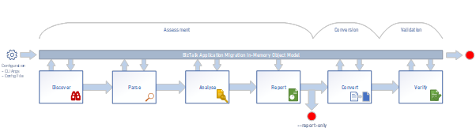

# Tool Architecture

## HOW THE SOLUTION WORKS

The core design of the migration toolset is designed to be easy to extend and enhance by the wider open source community as well as customer developers.  The design that our solution would use is based on the execution of a simple pipeline of steps with well-defined roles for each step.  These steps align with the journey as defined in the RFQ, namely Assessment, Conversion and Validation.  Our steps would be more granular, in-line with the single responsibility principle, where the Assessment stage is broken down into four distinct stages of Discover, Parse, Analyse and Report, which the following diagram shows.

## CORE DESIGN OF THE TOOL

The tool is implemented as a class library that has an entry point for an Executor that bootstraps the execution with the necessary configuration to run successfully, before managing the execution of the pipeline stages.  In common with a plug-in style of architecture, the components for each stage will be discoverable in a known location on the machine the tool is run.  The discovered components will be parsed and sorted into the pipeline stages based on the interfaces they implement.

The output storage for the tool, such as reports and converted assets, is dependent on the implementation of the component that supports that particular stage.  For example, a report that describes what artefacts have been discovered and analysed for a BizTalk application could be written in markdown format on the local drive, or a PDF document could be generated that is subsequently stored in Azure blob storage.

### IN-MEMORY OBJECT MODEL

The tool, when it is run, maintains an Execution State in memory.  Components are responsible for reading and writing to the execution state, for example, creating a canonical representation of a BizTalk application, or capturing the details of an error encountered during conversion, or saving the results of tests that are run during verification.

When the tool starts, it seeds the object model with external configuration provided to the tool.  This provides component specific configuration that informs components how (or if) they should execute.  Execution can also be halted by setting a property in the object model – if an unrecoverable error occurs, the error details can be added to the object model with a flag indicating that execution should be halted.

The object model, containing the BizTalk application representation, provides each component with the information it needs to function, for example, an orchestration analyser needs to find a list of orchestrations and their associated definitions (ODXs) that were previously found by a discovery component, which in turn may have extracted the orchestration definitions from DLLs found in a BizTalk application MSI file.  Each component is also able to add to the model or update the model, as appropriate to its function.  Downstream components will often depend on upstream components having updated the model.

### RUN ORDER OF COMPONENTS AT EACH STAGE

The tool runs components for each stage generally in an arbitrary order.  However, we believe it is also a good idea to allow components to be prioritised so components that require the object model to have been updated by another component, can be given a lower priority than the component it depends on.

Having a simple numerical order ensures that we don’t have to implement a complex dependency tree between components within a stage.  But more critically, by supporting this, we don’t have to introduce additional complexity by having to add new stages, which would dilute the simplicity of the design.

An example where this might have been the case is where a component produces a set of test cases to support the verification of a completed migration.  The test cases are produced by the analysis of schemas, maps, orchestrations and are run in the Analyse stage, but have to run after the components that analyse those same artefacts.  Without a priority order, we may have had to add a new Testing stage after the Analyse stage, that may run in parallel to the Report stage.

Another example is where a pattern analyser component reviews the output of the orchestration analyser to look for common enterprise application integration patterns.  These patterns may be represented by pre-canned Logic Apps and therefore the conversion stage would simply deploy an instance of the pre-canned Logic App.

The following diagram illustrates how this might work, where the P1, P2 and the different colours, etc, define the priority order.

### EXTENDING THE TOOL

Each of the stages of the tool are represented by an interface that is implemented by one or more components.  As this is a pluggable architecture and given the diverse array of BizTalk features and artefacts, it is expected that there will be many components developed for each stage.  This is key for the extensibility of the toolset and to support an open source approach to community contributions.

Core components are created in-tree, but we should also expect that some components may be created in other repos and pulled in as required, for example, where a third-party vendor has created a paid-for component or suite of components to support a specific scenario such as the migration of a full accelerator; or where a third-party adapter vendor has created a migration component to use their equivalent in Azure.

Components can implement one or more interfaces for each stage they want to support.  Components that analyse and then convert would implement both interfaces; other components may only perform a discovery or produce a report and so on.
