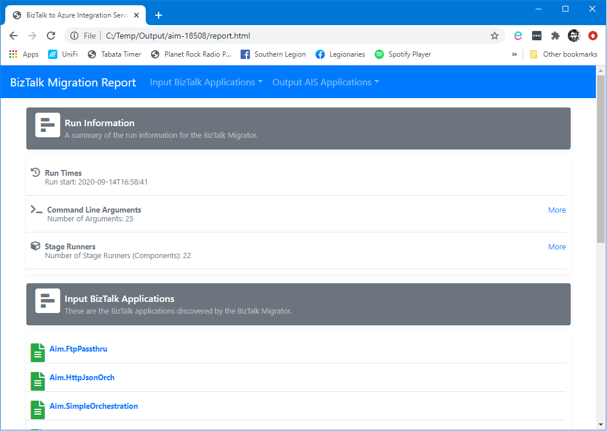

# <a name="top">Quick Start Guide</a>

This guide is intended to quickly get you up and running with the BizTalk Migrator.

This guide has the following sections:

[Prerequisites](#prerequisites)  
[Installing](#installing)  
[Running the tool](#running-the-tool)  
[Viewing the report](#viewing-the-report)  
[Understanding the output](#understanding-the-output)  
[If something goes wrong](#troubleshooting)

## Prerequisites

For installing and running the tool:

- Windows 10 or Windows Server
- Chocolatey ([https://chocolatey.org/](https://chocolatey.org/))

For installing and running the output:

- Azure CLI
- Active Azure subscription
- Windows PowerShell or PSCore

[Back to top](#top)

## Installing

You can install using Chocolatey via the following command:

`choco install biztalkmigrator`

If that install fails, you can try adding the --pre switch to install the latest pre-release version:

`choco install biztalkmigrator --pre`

Upgrade to a new version with this command:

`choco upgrade biztalkmigrator`

Uninstall from your system with this command:

`choco uninstall biztalkmigrator`

[Back to top](#top)

## Running the tool

Once you have installed the BizTalk Migrator you can run it from the command line.

### Export your applications as BizTalk MSIs

The BizTalk Migrator currently expects you to have exported your BizTalk applications from the BizTalk Admin Console as MSIs. 
This packages up your application assemblies and bindings and ensures the BizTalk Migrator has all the information it needs to analyze your application.

Instructions on this are available [here](https://docs.microsoft.com/en-us/biztalk/core/how-to-export-a-biztalk-application#:~:text=Using%20the%20BizTalk%20Server%20Administration%20console&text=Right%2Dclick%20the%20application%20that,file%2C%20and%20then%20click%20Next.).

### Command-line reference

Here is a list of useful command-line arguments.  For a full list of arguments please check out the [User Guide](./user-guide/README.md).

`aim [command] [options]`

#### Commands

| Command | Description |
| -------- | ------- |
| assess | Runs only the stages associated with assessment: Discover, Parse, Analyze, Report. |
| migrate | Runs all stages associated with migration: Discover, Parse, Analyze, Report, Convert, Verify. |
| convert | Runs only the stages associated with conversion: Convert, Verify. |
| verify | Runs only the stages associated with verification: Verify. |

#### Options

| Option | Description |
| -------- | ------- |
| -v, --verbose | Output verbose logging. |
| --verbose-level &lt;verbose-level&gt; | Specifies the level of verbose logging, if verbose logging is switched on using the -v option. Use '-' for minimum trace outputand '+' for full trace logging. Default is '-'. [default: -] |
| --no-abort | Don't abort on first exception encountered from a stage runner and allow subsequent stage runners to continue to run. Default is false. | 
| --abort-stage &lt;abort-stage&gt; | Abort at the end of a stage when any exception encountered from a stage runner. Default is not to abort at the end of a stage. This option, if used, must be used in conjunction with --no-abort. |
| -f, --find-path &lt;find-path&gt; | One or more paths to directories containing stage runners. Default find paths can be specified in the application configuration file (appsettings.json). This is an additive option, so paths specified in configuration file will be added to by paths specified on the command line. | 
| -p, --find-pattern &lt;find-pattern&gt; | Specify a search pattern for finding stage runner libraries. Use * (zero or more chars) and ? (exactly zero or one char) as wildcards. Default is "*.dll", however, this can be overridden in the application configuration file (appsettings.json). | 
| -a, --arg &lt;arg&gt; | Arbitrary arguments that are passed through to stage runners.  Format key=value. Multi-item values are accepted using a delimiter. Complex objects are supported by passing JSON string (use single quotes around the argument). | 
| --arg-delimiter &lt;arg-delimiter&gt; | Specifies a delimiter for a multi-value argument. Default is a pipe (\|) character. | 
| -w, --working-path &lt;working-path&gt; | Change the current working directory to a different path for the tool execution. Default is current directory. This option will affect any relative paths specified in other options. |
| -s, --state-path &lt;state-path&gt; | Path to store run state during execution of the tool. Default is the working directory. | 
| --save-state | Saves the runner execution state to disk before and after each stage runner. | 
| --save-stage-state | Saves the runner execution state to disk before and after each stage. | 
| --target &lt;Consumption\|Ise&gt; | Azure Integration Services target environment: Consumption or Ise (Integration Service Environment). | 
| --subscription-id &gt;subscription-id&gt; | Specifies the Azure Subscription ID to use for resource template rendering, if the templates require the subscription ID. | 
| --primary-region &lt;primary-region&gt; | Specifies the Azure Primary Region to use for resource template rendering, if the templates require the primary region. |
| --secondary-region &lt;secondary-region&gt; | Specifies the Azure Secondary Region to use for resource template rendering, if the templates require the secondary region as a paired region. |
| -e, --deployment-env &lt;deployment-env&gt; | Specifies the deployment environment to use for resource template rendering. Default is the 'dev' environment. |
| --unique-deployment-id &lt;unique-deployment-id&gt; | Specify a unique value to be used in the resource name when generating Azure resources. Set this to a short value, such as an abbreviated company name. Default is a random string. Max length is 5 characters. |
| --version | Show version information. |
| -?, -h, --help | Show help and usage information. |
| microsoft.biztalk.msidiscoverer.msifiles | One or more paths to MSI files, separated by the argument delimiter (default '\|' character). | 
| microsoft.biztalk.msidiscoverer.msidir | Path to a directory containing MSI files. |
| microsoft.biztalk.msidiscoverer.unpackdir | Path to a directory where the MSI files will be unpacked. |
| microsoft.biztalk.htmlreporter.reportfile | Path to a file where the HTML report will be written. |

### Example commands

Specify verbose logging:  
    `aim assess -v`

  Specify single MSI file:  
    `aim assess -a "microsoft.biztalk.msidiscoverer.msifiles=C:\msi\app.msi"`

  Specify multiple MSI files:  
    `aim assess -a "microsoft.biztalk.msidiscoverer.msifiles=C:\msi\app1.msi|C:\msi\app2.msi"`

  Specify directory containing MSI files:  
    `aim assess -a "microsoft.biztalk.msidiscoverer.msidir=C:\msi"`

  Specify directory containing MSI files with unpack directory:  
    `aim assess -a "microsoft.biztalk.msidiscoverer.msidir=C:\msi" -a "microsoft.biztalk.msidiscoverer.unpackdir=C:\temp"`

  Specify a custom report file name and location:  
    `aim assess -a "microsoft.biztalk.htmlreporter.reportfile=C:\reportoutput\report.html"`

[Back to top](#top)

## Viewing the report

The BizTalk Migrator generates a report on the output of the tool.  The report has he following sections:

- Summary - contains the summary information and links to other pages.
- Source Applications - contains a page reporting on the contents of each BizTalk application.
- Message Bus - contains details of the core message bus application that will be created to replace BizTalk.
- Target Applications - contains a page for each migrated application.

[Back to top](#top)

## Understanding the output

Depending on the options you have selected, the BizTalk Migrator will generate the following output on your local file system:

- Unpack - this contains the unpacked BizTalk MSIs.
- Report - a series of HTML files reporting on the migration.
- State - the underying state model of the tool that describes the source and target applications as a JSON object.
- Output - the scripts and templates that will create your target applications in Azure.

[Back to top](#top)

## Troubleshooting

### Continue on Error

The tool is configured to stop on error, by default. For example, if you specify an incorrect MSI file name, the tool will generate an error and stop. However, in some cases you may wish to continue.

For example, if you are missing a dependent MSI file (for a common application) but you still want to continue with generating a report, or creating the deployment scripts, you can use the no-abort flag to indicate that the tool should keep executing: 
    `--no-abort`

An error will still be generated, but the tool will continue on as far as it can.  

### ARM Deployment Issues

Everyone's Azure subscription is different, in terms of what is currently deployed at the time the deployment scripts are executed. 
In order to ensure that the deployment scripts would execute successfully, and to keep down costs by not automatically deploying expensive resources, we made some assumptions about what was currently deployed.
Specifically, we assume that:  

- You don't have an existing *Azure App Configuration* using the "Free" SKU in your subscription
- You don't have an *Integration Account* using the "Free" SKU in the same region in your subscription  

If either of the above are true, then the deployment will fail, as Azure will be unable to deploy an additional "Free" SKU of either of those resource types.  

For information on how to use your own *Azure App Configuration* or *Integration Account* instance, see the [Frequently Asked Questions](frequently-asked-questions.md).

[Back to top](#top)
