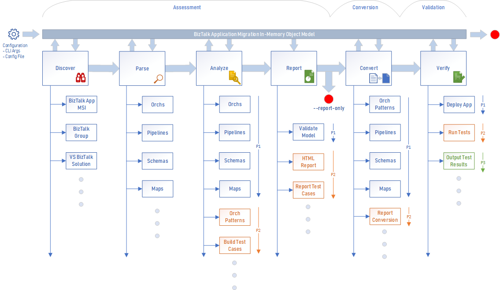
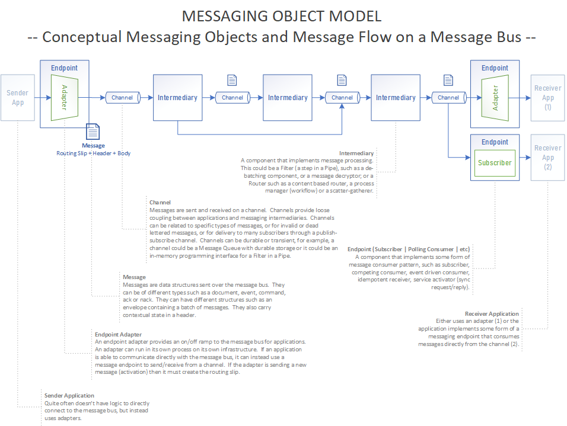
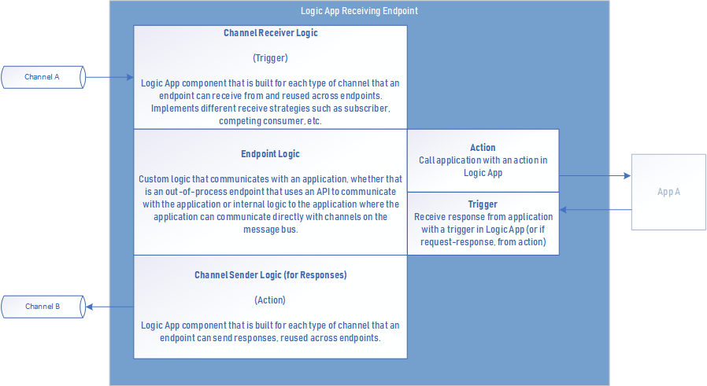
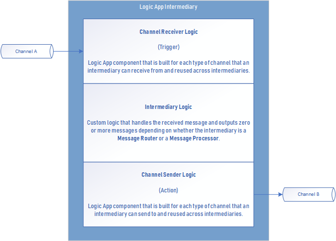
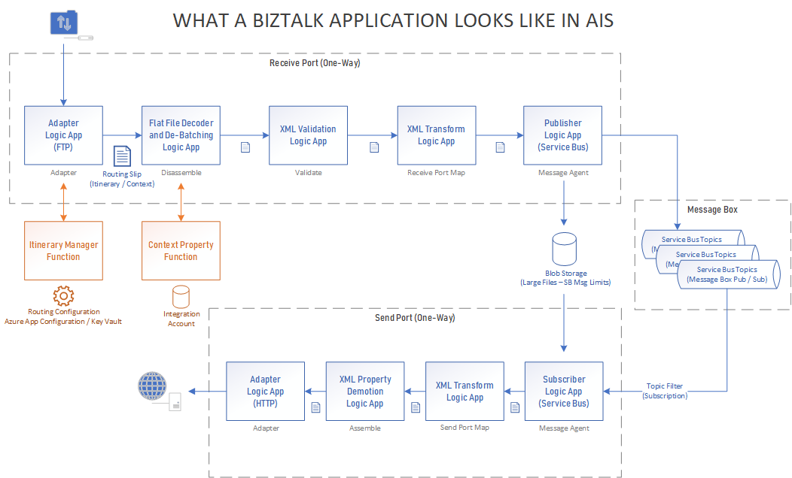
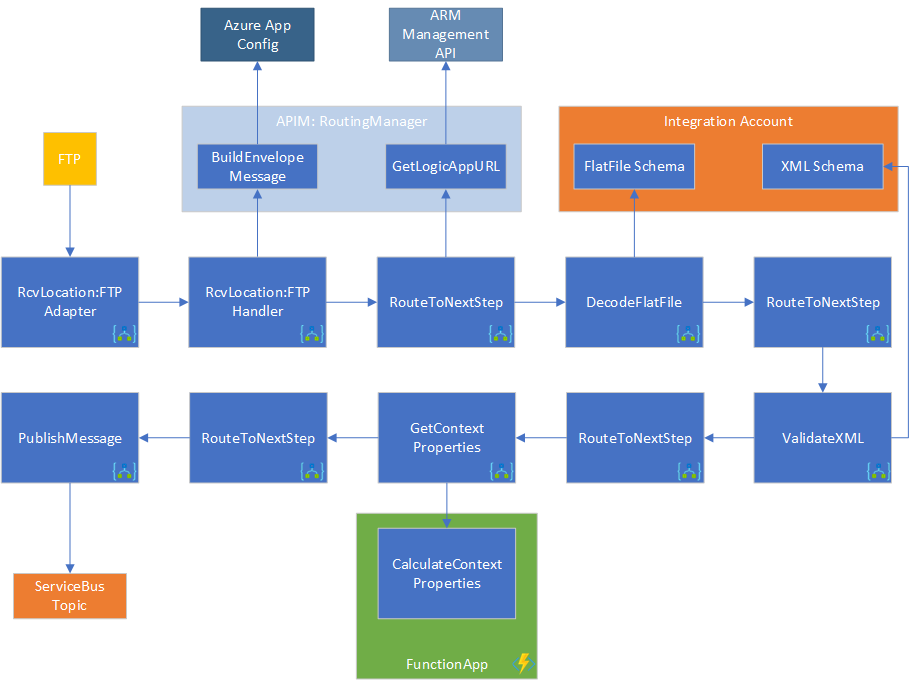
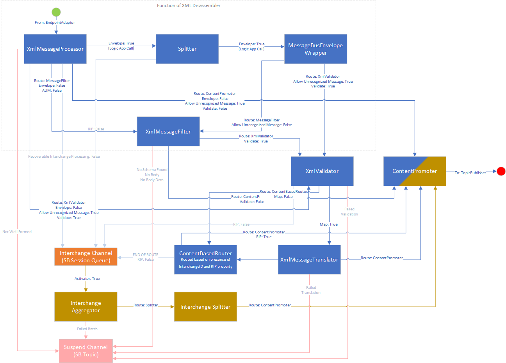
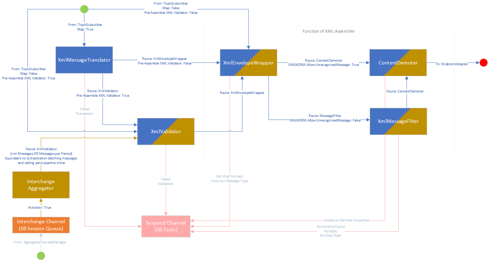
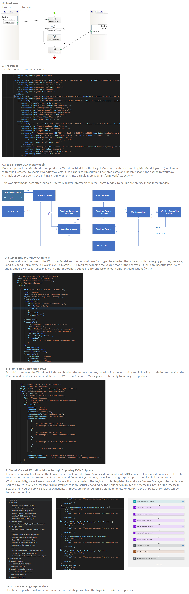
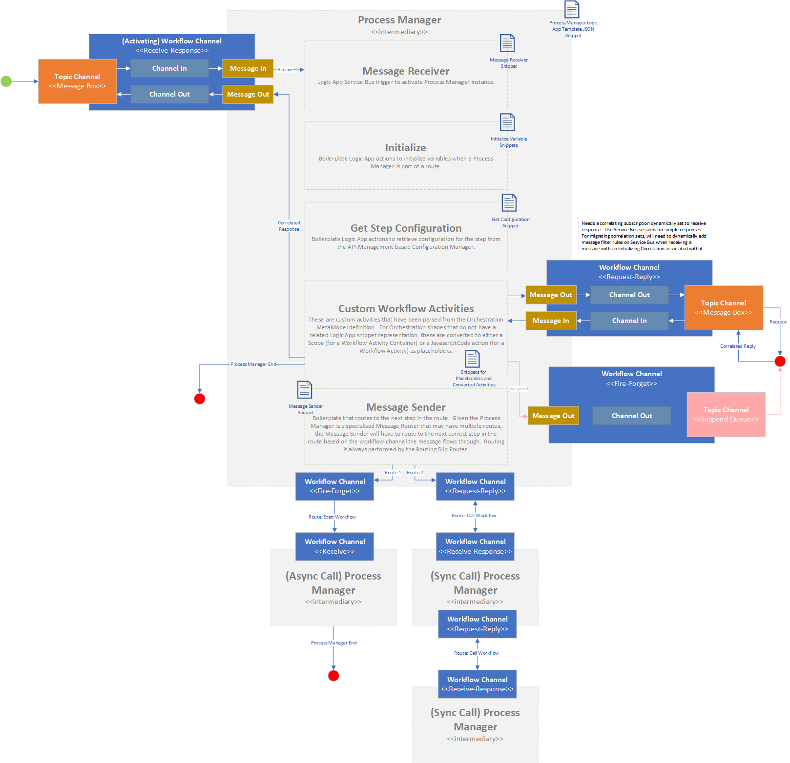

# How the migration process works

## Stages of Execution

The BizTalk Migrator executes components in a sequence of stages:

These stages are as follows:

- [Discover](#discover)
- [Parse](#parse) 
- [Analyze](#analyze)
- [Report](#report)
- [Convert](#convert)
- [Verify](#verify)

### Discover

In the **Discover** phase the BizTalk Migrator identifies and lists the BizTalk artefacts that need to be converted.  
This involves opening up the BizTalk MSI and reading the assemblies, the Application Definition File and the Binding Info file.

### Parse

In the **Parse** phase the BizTalk Migrator reads and decodes the BizTalk components and builds a data model of the BizTalk application.

### Analyze

In the **Analyze** phase the BizTalk Migrator analyzes the BizTalk application and builds a data model of the equivalent application running in Azure Integration Services.

### Report

In the **Report** phase the tool generates a report of the information generated so far.
This contains both the "source model", i.e. the BizTalk application(s) that we the input for the tool,
and the "target model" - the applications that will be generated in Azure.

The report contains detailed information on the contents of the applications and will also tell you
when there are problems with conversion.

### Convert

In the **Convert** phase the target model - the data model representing the applications in Azure - is used in
conjunction with a template rendering engine to produce a set of source files that build your application(s) in Azure.

### Verify

Whilst not yet built into the BizTalk Migrator, the **Verify** stage is where you run the install scripts to deploy your application in Azure.  
You can then assess whether your application is sufficiently converted to meet your needs.

## Messaging Model

Because of the differences between BizTalk and Azure Integration Services (AIS) in terms
of their underlying technology and model, we do not perform a direct conversion between
BizTalk applications and Azure.  Instead, we look at the *integration patterns* that
each application is comprised of, and use this as the means of translation.

A BizTalk application is decomposed into a messaging model:

The messaging model breaks any application down to just 4 different elements:

### Endpoints

Endpoints are the external communication with other systems, and are analogous to adapters in BizTalk.

### Channels

Channels are conduits for messages and are the logical links between components, regardless of communication protocol.  
Channels allow loose coupling between components, as work is routed between components.  This routing
is achieved using the **Routing Slip Router** pattern.

### Intermediaries

Intermediaries are blocks of logical processing.  These represent your pipeline components, maps and orchestrations.

### Messages

The messages, as in BizTalk, are the data that is passed between the above components.

## Representing a BizTalk Application

Here is an example of a BizTalk receive port, broken down into the messaging model.

If we consider a simple messaging solution in BizTalk:

When this is broken down into the messaging model we get the following.

In this example there is an endpoint representing the adapter.  At the point of receipt
the endpoint needs to build the routing slip so that the messaging infrastructure knows 
where to send the message for processing.

Routing is a complex task, and the BizTalk Migrator gives you everything you need to do this
out of the box.  A routing manager will make an API call to find the HTTP location of the next Logic App
(note that this URI is deployment-dependent and will change per environment).  We have also 
provided the functions and caching in API management to support this.

The next stage is pipeline processing.  In this example we are processing a flat file.  In BizTalk
we would use the Flat File Decoder pipeline component combined with a flat file schema.  In your migrated
application you will get a Logic App to perform the flat file decode, with a flat file schema saved in 
your integration account.

Next, you may expect to use an XML Disassembler component to parse and validate your XML message.  
This is a separate Logic App that is provided to you.

Before we publish the message we get the context properties via a Content Promoter Logic App.  This performs 
the XPath lookups that would happen during XML Disassembly in BizTalk. 

Finally, the message is published to the "Message Box" - in this case we publish to an
Azure Service Bus topic, which supports publish-subscribe messaging.

## XML Disassembly and Assembly

The BizTalk Migrator provides you with an implementation of the XML Receive and XML Send functionality
you currently enjoy in BizTalk.  We do not provide 100% feature parity (yet): priority has been
given to the most commonly used scenarios with others to follow later.

### XML Receive

### XML Send

## Orchestration Parsing

The most technically challenging aspect of BizTalk migration is orchestration conversion.  Orchestrations
give the most developer freedom, and the orchestration types and object model is the most complex.

The infographic below illustrates the orchestration parsing process:

### Process Manager

A converted orchestration is represented in the tool as a Process Manager, which contains details of the 
orchestration activation, the external connectivity and the internal activity hierarchy.

The diagram below illustrates the process manager:

